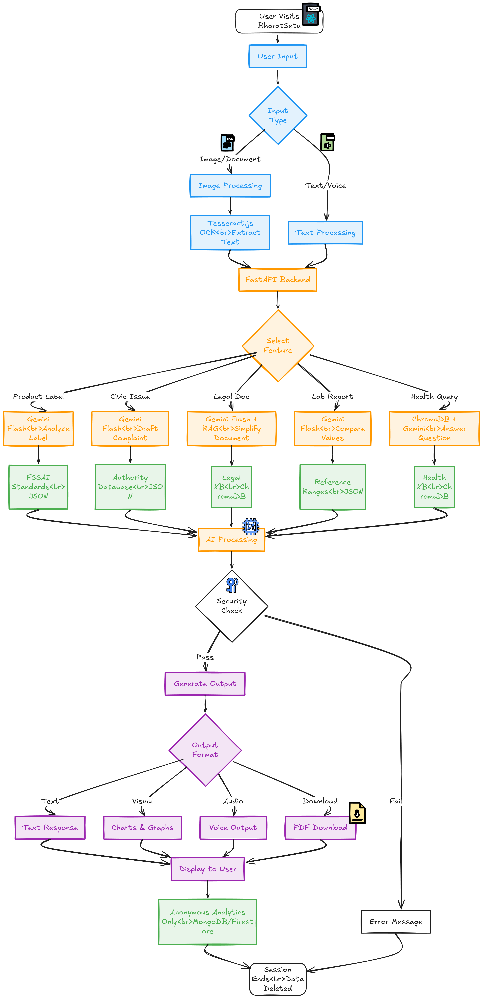

# BharatSetu Connect — Technical Documentation

This document describes the technology stack, architecture, costing, and performance considerations for the BharatSetu Connect prototype.

## User flow diagram

---

## 1. Tech Stack Overview

| Layer | Technologies |
|-------|---------------|
| **Frontend** | React 18, Vite, TypeScript, Tailwind CSS, Radix UI, React Router |
| **Backend** | AWS Lambda, Amazon API Gateway, AWS Amplify (Gen 2 Backend) |
| **AI/ML** | Amazon Bedrock (foundation models), ElevenLabs (TTS & STT) |
| **Data & storage** | Stateless backend; client-side localStorage for selected features; S3 recommended for production |

---

## 2. Frontend

### 2.1 Core

- **React** 18.3 with **TypeScript** — UI and type safety  
- **Vite** 5 — build tool, dev server, HMR  
- **React Router** 6 — client-side routing  
- **Tailwind CSS** 3 + **tailwindcss-animate** — styling and animations  

### 2.2 UI & UX

- **Radix UI** — accessible primitives (dialogs, dropdowns, tabs, etc.)  
- **Lucide React** — icons  
- **Framer Motion** — animations and scroll reveals  
- **next-themes** — light/dark theme  
- **Sonner** — toasts  
- **Vaul**, **cmdk**, **React Day Picker** — drawer, command palette, date picker  

### 2.3 Client-side logic & libraries

- **Tesseract.js** — in-browser OCR (images and PDFs)  
- **pdfjs-dist** — PDF rendering and first-page preview  
- **mammoth** — Word (.docx) text extraction  
- **i18next** + **react-i18next** — internationalisation (e.g. en, hi, mr, ta, te, gu)  
- **React Hook Form** + **Zod** + **@hookform/resolvers** — forms and validation  
- **TanStack Query** — server state (where used)  
- **Recharts** — charts (e.g. Lab Report Analyzer)  
- **date-fns** — date handling  
- **clsx**, **tailwind-merge**, **class-variance-authority** — class name utilities  

### 2.4 Deployment

- Frontend is built as a static SPA (`npm run build`).  
- Hosting: **AWS Amplify Hosting** or other static hosts (e.g. Vercel as per README).  

---

## 3. Backend (AWS)

### 3.1 AWS Amplify Gen 2 Backend

- **@aws-amplify/backend** (Gen 2) — backend definition and infrastructure-as-code  
- **AWS CDK** (aws-cdk-lib, constructs) — underlying stack (API, Lambda, IAM)  
- Single REST API: **API Gateway** (REST, stage: `dev`) with CORS enabled  

### 3.2 API Gateway

- **REST API** — `LabelAuditorApi`  
- **Endpoints (POST):**  
  - `/analyze-label` — Label Auditor (image/label analysis)  
  - `/analyze-lab-report` — Lab Report Analyzer  
  - `/civic-sense` — Civic Sense draft generation  
  - `/explain-document` — Rights Assistant document explanation  
  - `/tts` — Text-to-speech (ElevenLabs proxy)  
  - `/stt` — Speech-to-text (ElevenLabs proxy)  

### 3.3 Lambda functions

| Function | Purpose | Runtime | Key dependencies |
|----------|---------|---------|-------------------|
| **analyze-label** | Food/cosmetics label analysis + user query | Node 20 | Bedrock (Converse) |
| **analyze-lab-report** | Lab report parsing, parameters, summary, suggestions | Node 20 | Bedrock (Converse) |
| **civic-sense** | Civic complaint draft generation | Node 20 | Bedrock (Converse) |
| **explain-document** | Legal document simplification + user query | Node 20 | Bedrock (Converse) |
| **tts** | TTS proxy to ElevenLabs | Node 20 | ElevenLabs API |
| **stt** | STT proxy to ElevenLabs Scribe | Node 20 | ElevenLabs API |

- **IAM:** Each Bedrock-using Lambda has `bedrock:InvokeModel` and (where applicable) `aws-marketplace:ViewSubscriptions`, `aws-marketplace:Subscribe`.  
- **Model:** Default foundation model is **Google Gemma 3 27B IT** (`google.gemma-3-27b-it`) in **ap-south-1**, overridable via `BEDROCK_MODEL_ID`.  
- **TTS/STT:** `ELEVENLABS_API_KEY` is passed to the `tts` and `stt` Lambdas when set.  

### 3.4 Amazon Bedrock

- **Service:** Amazon Bedrock (invoked via **@aws-sdk/client-bedrock-runtime** in Lambda).  
- **Use:** Converse API for multi-turn–style prompts (single request/response per call).  
- **Models:** Foundation models (e.g. `google.gemma-3-27b-it`); Marketplace subscriptions may be required in some regions.  
- **Region:** Prototype uses **ap-south-1** (Mumbai).  

---

## 4. Data Storage

### 4.1 Current (prototype)

- **Backend:** Stateless — no database; no persistence of uploads or analysis results.  
- **Client:**  
  - **localStorage** — used for limited client-only state (e.g. GynaeCare period data via `storageManager`).  
  - No user accounts or server-side sessions in the current prototype.  

### 4.2 Production recommendations

- **Amazon S3** — store uploaded documents, generated reports, or audit logs.  
- **Amazon DynamoDB** (or RDS) — user metadata, session or usage metadata, if needed.  
- **CloudWatch Logs** — Lambda and API logging; optional metrics for benchmarking.  

---

## 5. External APIs

### 5.1 ElevenLabs

- **TTS (Text-to-Speech)**  
  - **Usage:** "Listen" to summaries (e.g. Lab Report, Rights Assistant).  
  - **Flow:** Frontend → `POST /tts` (Lambda) → ElevenLabs API → returns audio (e.g. base64 MP3).  
  - **Model:** e.g. `eleven_multilingual_v2` (configurable via `ELEVENLABS_TTS_MODEL_ID`).  
  - **Languages:** en, hi, mr, gu, ta, te (and other supported locales).  

- **STT (Speech-to-Text)**  
  - **Usage:** Voice input for document query and "Ask about rights" question.  
  - **Flow:** Frontend records audio → `POST /stt` (Lambda) → ElevenLabs Scribe API → returns transcript.  
  - **Model:** e.g. `scribe_v2` (90+ languages).  

- **Authentication:** API key stored in Lambda env (`ELEVENLABS_API_KEY`), not exposed to the client.  

---

## 6. Costing of the Tech Stack

### 6.1 AWS (indicative, ap-south-1)

| Service | Usage assumption (example) | Rough monthly cost (USD) |
|--------|-----------------------------|---------------------------|
| **Lambda** | ~50k invocations, 512 MB, ~5 s avg | ~2–5 |
| **API Gateway** | ~50k REST requests | ~2–3 |
| **Bedrock** (Gemma 3 27B) | ~10k input + 10k output tokens/day | ~5–15 (model-dependent) |
| **Amplify Hosting** | Static build, moderate traffic | ~0–5 (free tier may apply) |
| **CloudWatch** | Logs + a few metrics | ~1–3 |
| **Total (AWS)** | | **~10–30** |

- Bedrock and Lambda costs depend on model, token volume, and concurrency.  
- Free tiers (Lambda, API Gateway, Amplify) reduce cost at low usage.  

### 6.2 ElevenLabs

| Plan | Typical use | Rough cost |
|------|-------------|------------|
| **Free** | Limited characters (TTS) / minutes (STT) | $0 |
| **Starter** | ~30k TTS chars, limited STT | ~$5/month |
| **Creator** | Higher limits, more voices | ~$22/month |

- Actual cost depends on characters (TTS) and minutes (STT) consumed.  
- Check [ElevenLabs pricing](https://elevenlabs.io/pricing) for current tiers.  

### 6.3 Overall (prototype)

- **Low-traffic prototype:** ~**$15–50/month** (AWS + ElevenLabs) depending on usage and plan.  
- **Production:** Add S3/DynamoDB, higher Bedrock and Lambda usage, and monitoring; re-estimate from real traffic and token counts.  

---

## 7. Prototype Performance Report / Benchmarking

### 7.1 What to measure

- **Frontend**  
  - **LCP / FCP:** First load of the SPA.  
  - **Time to interactive:** After React hydrate and router ready.  
  - **Bundle size:** Vite build output (e.g. main chunk, vendor, lazy-loaded routes).  
  - **OCR (Tesseract):** Time from "Run OCR" to extracted text (client-side, device-dependent).  

- **Backend**  
  - **Latency per endpoint:** Time from request to response (p50, p95, p99).  
  - **Cold start:** First request to each Lambda after idle.  
  - **Bedrock:** Token throughput and latency per request.  
  - **TTS/STT:** End-to-end time (frontend → Lambda → ElevenLabs → response).  

### 7.2 Suggested benchmarks (example)

| Metric | Target (example) | How to measure |
|--------|-------------------|----------------|
| **Lab Report analysis** | &lt; 15 s end-to-end | Browser: click "Analyze" to result visible; or API client timing. |
| **Explain document** | &lt; 20 s for 2–3 pages | Same as above for "Explain this document". |
| **TTS (Listen)** | &lt; 5 s for first chunk | Time from "Listen" to audio start. |
| **STT (Voice)** | &lt; 3 s after stop recording | Time from stop to transcript in UI. |
| **Label Auditor** | &lt; 10 s | Upload + question to answer. |
| **Lambda cold start** | &lt; 3 s | CloudWatch or custom timing header. |

---

## 8. References

- [AWS Amplify Gen 2 Backend](https://docs.amplify.aws/react/build-a-backend/)
- [Amazon Bedrock](https://aws.amazon.com/bedrock/)
- [ElevenLabs API](https://elevenlabs.io/docs)
- [Vite](https://vitejs.dev/)
- [React](https://react.dev/)
